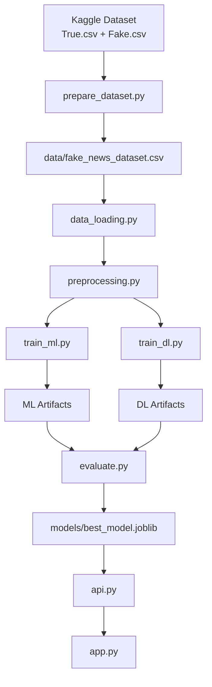
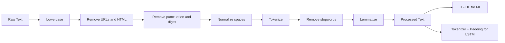

# Fake News Detection using Machine Learning and Deep Learning

Authors: `Ayman El Ouardiji` and `Ilyas El Alaoui Saleh`

This project builds a complete fake news detection pipeline for English news articles. It covers dataset preparation, NLP preprocessing, machine learning training, deep learning training, evaluation, best-model selection, API serving with FastAPI, and a web interface with Streamlit.

The repository was verified end to end with the Kaggle dataset `clmentbisaillon/fake-and-real-news-dataset`. After preparation and cleaning, the pipeline trained three classical models and one LSTM model, compared them with the same evaluation protocol, and selected `linear_svm` as the best deployed model.

## Final Verified Result

- Best model: `linear_svm`
- Model type: `ml`
- Best F1-score: `0.9983939261206015`
- Dataset used for training after cleaning: `44,267` rows
- Raw combined dataset after preparation: `44,898` rows

## Project Structure

```text
FakeNewsDetection/
|-- data/
|   `-- fake_news_dataset.csv
|-- models/
|   |-- best_model.joblib
|   |-- linear_svm.joblib
|   |-- logistic_regression.joblib
|   |-- naive_bayes.joblib
|   |-- lstm_model.keras
|   `-- supporting metadata, tokenizers, and preprocessors
|-- outputs/
|   |-- figures/
|   |   |-- linear_svm_confusion_matrix.png
|   |   |-- logistic_regression_confusion_matrix.png
|   |   |-- naive_bayes_confusion_matrix.png
|   |   |-- lstm_confusion_matrix.png
|   |   `-- lstm_training_curves.png
|   `-- metrics/
|       |-- ml_results.csv
|       |-- dl_results.csv
|       |-- model_comparison.csv
|       `-- best_model_summary.json
|-- src/
|   |-- prepare_dataset.py
|   |-- data_loading.py
|   |-- preprocessing.py
|   |-- ml_models.py
|   |-- dl_models.py
|   |-- train_ml.py
|   |-- train_dl.py
|   |-- evaluate.py
|   `-- utils.py
|-- api.py
|-- app.py
|-- requirements.txt
|-- README.md
```

## System Overview



## Dataset

Source dataset:
- Kaggle dataset: `clmentbisaillon/fake-and-real-news-dataset`
- Source files: `True.csv` and `Fake.csv`

Combined dataset columns:
- `title`
- `text`
- `subject`
- `date`
- `label`

Label convention:
- `REAL` for rows from `True.csv`
- `FAKE` for rows from `Fake.csv`

During loading, the project:
- keeps the `text` and `label` columns for training
- removes missing rows
- removes empty texts
- normalizes labels to uppercase
- maps labels to integers with `REAL -> 0` and `FAKE -> 1`

## Step-by-Step Workflow

### 1. Install dependencies

```bash
python -m pip install -r requirements.txt
```

### 2. Prepare the Kaggle dataset

```bash
python -m src.prepare_dataset
```

What this step does:
- downloads the Kaggle dataset with `kagglehub`
- loads `True.csv`
- loads `Fake.csv`
- adds a `label` column
- concatenates both files
- saves the merged file to `data/fake_news_dataset.csv`

### 3. Train the machine learning models

```bash
python -m src.train_ml
```

Implemented models:
- Logistic Regression
- Linear SVM
- Multinomial Naive Bayes

Pipeline for ML training:
- clean and normalize text
- tokenize with NLTK
- remove stopwords
- lemmatize
- vectorize with TF-IDF using unigrams and bigrams
- tune hyperparameters with `GridSearchCV`
- evaluate on the held-out test set

### 4. Train the deep learning model

```bash
python -m src.train_dl
```

Implemented DL model:
- LSTM classifier using TensorFlow/Keras

Pipeline for DL training:
- clean and normalize text
- tokenize text
- build integer sequences
- pad sequences to fixed length
- train embedding + LSTM network
- save best checkpoint and tokenizer

### 5. Aggregate results and select the best model

```bash
python -m src.evaluate
```

This step:
- combines the ML and DL metrics
- creates `outputs/metrics/model_comparison.csv`
- creates `outputs/metrics/best_model_summary.json`
- stores the selected deployment metadata in `models/best_model.joblib`

### 6. Run the API

```bash
uvicorn api:app --reload
```

API endpoint:
- `POST /predict`

Example request:

```json
{
  "text": "Breaking news article text goes here."
}
```

Example verified response:

```json
{
  "label": "FAKE",
  "probability_fake": 0.8207,
  "probability_real": 0.1793,
  "model_name": "linear_svm"
}
```

### 7. Run the Streamlit application

Start the API first, then run:

```bash
streamlit run app.py
```

The Streamlit app sends the input text to the FastAPI backend and displays:
- predicted label
- probability of `FAKE`
- probability of `REAL`
- deployed model name

## Preprocessing Pipeline



## Model Comparison

| Model | Accuracy | Precision | Recall | F1-score | Training Time (s) |
|---|---:|---:|---:|---:|---:|
| Linear SVM | 0.998344 | 0.999415 | 0.997375 | 0.998394 | 510.6498 |
| Logistic Regression | 0.996236 | 0.998243 | 0.994457 | 0.996347 | 533.1647 |
| LSTM | 0.993224 | 0.988732 | 0.998250 | 0.993468 | 1555.6750 |
| Naive Bayes | 0.959042 | 0.964664 | 0.955659 | 0.960141 | 417.2454 |

## Deployment Architecture


## Generated Outputs

Important generated files:
- `data/fake_news_dataset.csv`
- `models/best_model.joblib`
- `models/linear_svm.joblib`
- `models/lstm_model.keras`
- `outputs/metrics/ml_results.csv`
- `outputs/metrics/dl_results.csv`
- `outputs/metrics/model_comparison.csv`
- `outputs/metrics/best_model_summary.json`
- `outputs/figures/linear_svm_confusion_matrix.png`
- `outputs/figures/lstm_training_curves.png`

## Notes

- The project now lazily loads TensorFlow-dependent components so the ML path and the deployed API can work cleanly even when the selected model is not deep learning.
- The default ML search configuration is set to complete reliably on a local machine without spawning runaway worker processes.
- The API and Streamlit application were both verified after training.

## Recommended Run Order

If you want to reproduce the full project from scratch, use this exact order:

```bash
python -m pip install -r requirements.txt
python -m src.prepare_dataset
python -m src.train_ml
python -m src.train_dl
python -m src.evaluate
uvicorn api:app --reload
streamlit run app.py
```
